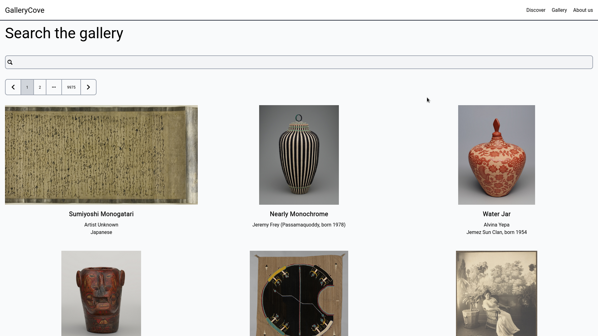
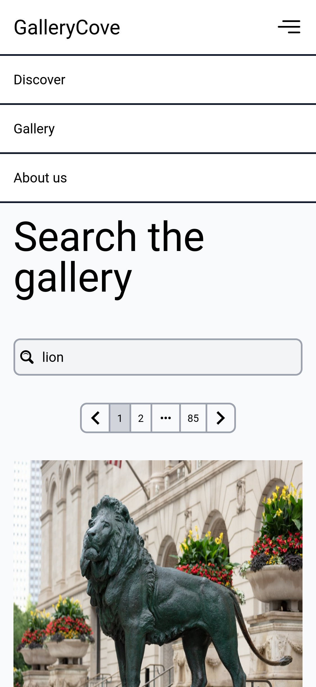

# Google - Python Workshop

Code from Google Python Workshop "Google Atelierul Digital - Programare" from
april-may 2023.

## Homeworks

#### Week1

- [A CNP (personal identification number from Romania) validator](week1/homework1/cnp_validator.py)
    * Deepen understanding of how to use basic control flow instructions and
      built in data structures.

#### Week2

- [A calculator in command-line](week2/homework1/basic_calculator.py)
    * Using functions for a better code organization.
- [An expression evaluator in cmd](week2/homework1/expression_evaluator.py)
    * A bonus calculator which I did to evaluate an expression. This method
      transforms the input in postfix notation for ease in evaluation.

#### Week3

- [To-do list CLI](week3/todo)
    * Leverage python knowledge in a more complex app.
    * Learn how to organize an application.
    * Application's features: add categories, show categories, add a task (which
      contains some infos, deadline, the person assigned to do it, a category, and
      if the task exists an error will be thrown), a menu from each action can be done,
      sorting tasks by fields, filter by fields, edit tasks, delete tasks.
    * Usage:

First argument is the path to the file with to-do elements and the second
argument is the path to the file with categories, if one or both are not
provided the program will create the files in current directory.

The command bellow assumes that you run the program from the root directory of
this repository.

```shell
python3 week3/todo path/todos path/categories
```

- [Web Scraper](week3/webscraper)
    * Learn the structure of web pages and how to gather data from them.
    * Learn how to work with external dependencies and to manage them with pip.
    * How to run the script:

The command bellow assume that your current directory is the root directory of
this repository, you will first create an isolated environment and download
some dependencies.

```shell
cd week3/webscraper
python3 -m venv venv
source venv/bin/activate
pip install -r requirements.txt
```

#### Week4

- Learn about object-oriented programming principles and how to apply them in
  Python.
- Learn about decorators and how to use them.
- Learn about iterators.

#### Week5 - Week7

- Learn about web applications and how to build them with Django and Django
  REST Framework
- Learn how to use SQL and Django ORM
- Build a [demo app](web_app) during the live code sessions. The application's features:
    * User authentication
    * CRUD operations on location
    * CRUD operations on companies

##### GalleryCove

- GalleryCove is a project where I showed what I learned from Django section of
  this course. I used an external API for fetching data about pictures.
    * I found the API on [Public APIs](https://github.com/public-apis/public-apis)
    * The API with art picture is [Art Institute of Chicago](https://api.artic.edu/docs/#introduction)
- I made for this project a responsive website with styles from Tailwind.
- The application consume an API with artworks and display them, it can also search artworks by
  content.
- How to run the project for development:

```shell
# Starting tailwind development watcher
python manage.py tailwind start
# Start django server
python manage.py runserver
```



